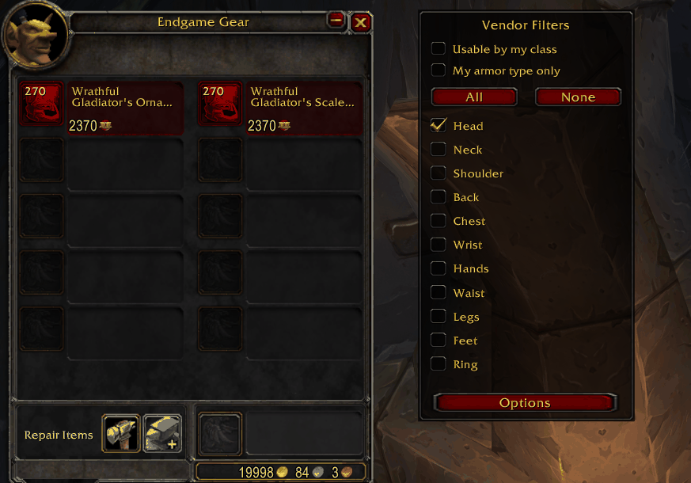
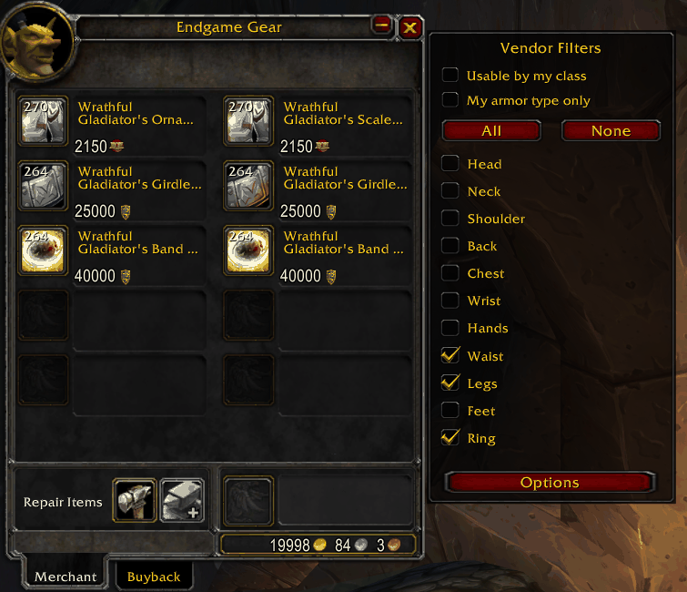
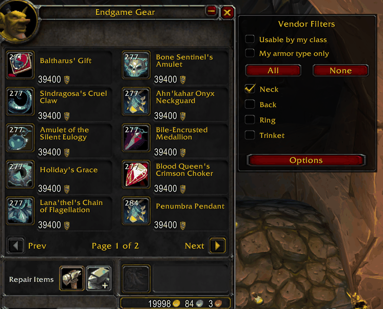

*[Read in English](README.md)*

# NPC Vendor Sort

Addon para **World of Warcraft 3.3.5a (WotLK)** que agrega filtros a la ventana de vendedor: podés mostrar solo las piezas de un slot de equipo concreto, y ver el item level y la calidad de cada objeto de un vistazo.

**Versión:** 2.1 · **Autor:** Nidhaus

## Qué hace

- Filtra el inventario del vendedor **por slot de equipo** (cabeza, hombros, pecho, armas, etc.).
- Muestra el **item level** de cada objeto directamente en el listado.
- Colorea los objetos según su **calidad** (común, poco común, raro, épico...).
- Panel de filtros integrado en la ventana del vendedor, sin ocupar espacio extra.
- Guarda tu configuración entre sesiones (`NPCVendorSortDB`).

## Capturas

Filtrando por un solo slot: solo los cascos del inventario del vendedor, con item level y colores de calidad:

Varios slots a la vez: cintura, piernas y anillos juntos:

El filtro también funciona en vendedores con varias páginas:

## Instalación

1. Cerrá el juego.
2. Copiá la carpeta `NPCVendorSort` dentro de `World of Warcraft\Interface\AddOns\`.
3. Iniciá el juego y activá el addon en el selector de la pantalla de personajes.

La ruta final tiene que quedar `Interface\AddOns\NPCVendorSort\NPCVendorSort.toc`.

## Comandos

| Comando | Qué hace |
|---|---|
| `/nvs` | Abre o cierra el panel de filtros |
| `/vendorsort` | Igual que `/nvs` |
| `/nvs reset` | Reactiva todos los slots y limpia los filtros |

## Compatibilidad

Interface 30300 — WotLK 3.3.5a. Probado en Warmane.

## Licencia

Uso libre. Si lo redistribuís o lo usás como base, mantené el crédito al autor.
